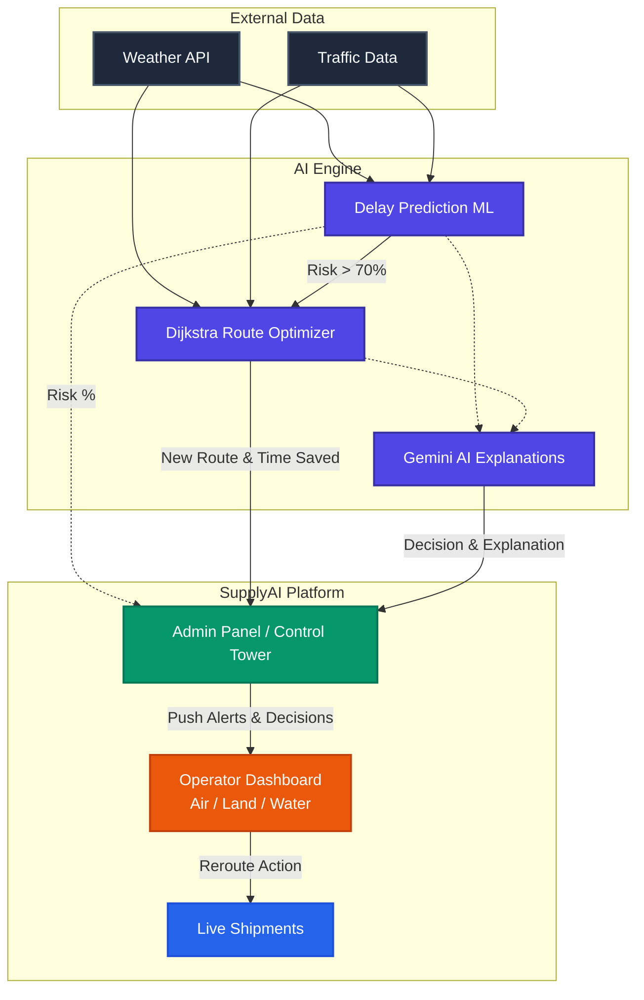

# SupplyAI - Smart Logistics Control Tower

A centralized Control Tower (Admin Panel) that monitors multi-modal shipments (Air, Land, Water) and proactively pushes disruption alerts + AI-driven routing decisions to Operator Dashboards.

## 💡 Core Concept

"A centralized Control Tower monitors all shipments and proactively pushes disruption alerts + AI-driven routing decisions to Mode-Specific Operator Dashboards (Air, Land, Water)."

- **Admin Panel (Control Tower):** The Brain + Authority. Sees all shipments, detects disruptions (weather, traffic collisions), pushes alerts, and triggers AI decisions. It acts as an orchestrator, not a micro-manager.
- **Operator Dashboard (Execution Layer):** A unified view with filters for modes. Operators see only their shipments, alerts pushed from the admin, and AI recommendations (e.g., "Change Route", "Delay expected: 65%").
- **AI Engine (Hidden Brain):** Runs in the backend, taking inputs like weather APIs, traffic data, and routes to output delay probabilities and alternative routes.

## ⚙️ How Things Work & System Flow



## 🧩 Tech Stack

- **Frontend:** React, Vite, React-Leaflet (Mapping), Recharts (Analytics), Vanilla CSS (Custom UI/Animations)
- **Backend:** FastAPI (Python), Async asyncio loops for simulation
- **Machine Learning:** Scikit-learn (RandomForest for delay prediction)
- **Generative AI:** Google Gemini 1.5 Flash (For human-readable reasoning and recommendations)
- **Data / Real-time:** In-memory simulation loop (or Firebase Firestore integration)

## 🚀 Future Scope 

1. **Event-Based Alerts (Smart Automation)**
   - *Current/Manual:* Admin manually sending storm alerts.
   - *Future/Automated:* The system detects storms automatically, displays it on the admin panel for quick approval, and dynamically pushes out the alert. This feels intelligent rather than manual.
2. **Multi-Modal Simplicity**
   - We focus on delivering different icons and slightly different speed+risk weights based on the transport mode.
     - **Air ✈️:** Less traffic, highly weather sensitive.
     - **Land 🚚:** High traffic impact.
     - **Water 🚢:** Slow but stable.
3. **Quantifiable Decision Impact**
   - When the AI engine suggests a route, it starkly highlights the real-world value:
     - *Old ETA: 10 hrs*
     - *New ETA: 7.5 hrs*
     - *Time saved: 2.5 hrs*
   - Transforming the project from just "cool tech" to undeniable business value.

## 🔑 Environment Variables & Setup

### Backend (`/project/backend/.env`)

Create a `.env` file in the backend root:
```ini
# Core
GEMINI_API_KEY=your_gemini_api_key_here
CORS_ORIGINS=http://localhost:5173

# Optional: Firebase persistence
FIREBASE_SERVICE_ACCOUNT_PATH=path/to/firebase-creds.json
```

### Running the Project Locally

We provide an automated start script for Windows environments.

1. Install Node.js and Python 3.10+
2. Double-click the `run.bat` file in the root directory.
3. The script will automatically:
   - Install backend dependencies (`pip install -r requirements.txt`)
   - Install frontend dependencies (`npm install`)
   - Start the FastAPI backend on `http://localhost:8000`
   - Start the React frontend on `http://localhost:5173`

*(For manual start, run `uvicorn app.main:app --reload` in `/project/backend` and `npm run dev` in `/project/frontend`)*
